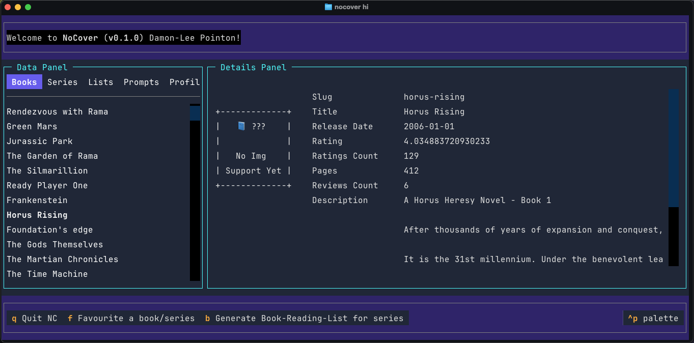

# NoCover

> STILL IN DEVELOPMENT - IT WILL BE BUGGY

A TUI application to supplement Hardcover.

## Why?

Yeah, a TUI for this doesn't need to be a thing. However, I've wanted to make a TUI for a while and Hardcover is a project i'm interested enough in to give it a go.

## Features

- Pull profile data from Hardcover API
- Pull books associated with account - ('want-to-read' and 'read').
    - books are displayed in a selectable list which then allows viewing of more data.
- Pull Series, Lists and Prompts associated with account.
    - So far this is based on internal csv.
    - Idea to be able to track these, while the site doesn't yet.

## TODO's

- [X] In case it could be used in another tool, choose where to save a BRL whilst defaulting to Config.SeriesPath
- [ ] Search for book to add to `want-to-read`, `read` or a local private list.
- [X] Loading Screen
- [X] Quick add Series
- [X] Quick add Lists
- [X] Quick add Prompts
- [ ] General Improvements to displaying data
- [ ] Tick toggle to add books to `want-to-read`
- [ ] Fully offline use
    - required downloading and storing of data in format that is easy to access.
    - use a local db such as DuckDB?
    - Won't matter for series downloaded as BRL file (yes I will push this as much as possible, i think it would be helpful.)
- [ ] Book Editor Modal
- [X] Better onboarding Modal
- [ ] Add book descriptions to brl file generation
- [ ] Add another...? To a modal.
- [ ] Add Logging
- [X] Move all config path into Config
    - Rewrote a couple of functions around this
    - Turns out I was manually building the path EVERY time i used it!
- [X] Convert to using TSV rather than CSV as many lists and prompts may have "," in title.
